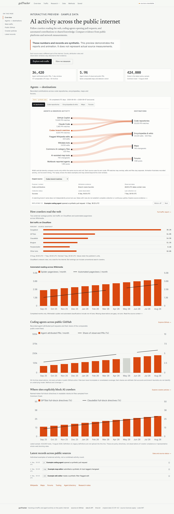
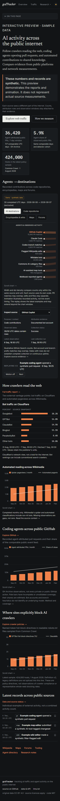

# Internet activity homepage and restored navigation

This draft builds on QA hardening PR #1 and refocuses the interface on evidence from external public sources. PR #1 remains separate; neither draft is merged or deployed to production.

## What changed

- The original left “On this page” menu returns, with desktop section highlighting and an expandable mobile menu.
- The Agents → destinations dashboard retains its orange paths, moving dots, destination filters, source inspection, record replay, Pause and reduced-motion behavior. Its destinations are code repositories, encyclopedias, maps and forums.
- Three supporting reports show published web traffic (Cloudflare and Wikimedia), agent-attributed public GitHub PRs, and explicit crawler-blocking policies in Common Crawl samples.
- Local visitor counts are removed from the homepage, Traffic, agent directory/profiles, Forums, Data and source-health API. The latest-record stream excludes site visits. Legacy Visitors URLs redirect to Traffic; the guestbook view redirects to Forums.
- Page-request analytics and the hidden footer trap link are disabled. No migration, DELETE, TRUNCATE, repair or historical reprocessing is introduced by this follow-up.

## Measurement boundaries

These sources cover different parts of the internet; the site does not claim a representative whole-internet total. Every flow source retains purpose, evidence, units, observation dates, latest observation, last collector run and explicit collector outcomes. Widths and dot density compare only the same feed and unit. Counts across feeds must not be added.

The flow uses 30 completed UTC days. Dates containing rows are not proof of continuous collection. GitHub Search matches may overlap. Bot accounts support account attribution, while branch names remain heuristics; neither identifies an underlying model. OSM uses capped, deduplicated collection v2. Commons counts additions of files to tracked categories, not uploads. Wikimedia automation includes conventional non-AI bots.

The homepage bounds monthly charts to 24 points and policy history to 18 samples. GitHub shares require comparable validated archive periods. Missing Wikimedia months remain gaps, including trailing missing months. Radar preserves the publisher's units, normalization, window and retrieval time. Policy charts use v2 explicit named-token full-block definitions without joining legacy definitions into their line; directives do not establish crawler compliance.

Independent reads run together and shared report/flow data is cached for five minutes. The homepage does not render hidden full-history charts.

## Data and compatibility

Stored history remains in the existing database. The previous retention policy continues; this PR does not promise indefinite retention. Legacy visitor/guestbook exports and the hardened guestbook API remain available for compatibility, but are not linked as dashboard data sources. Known retired paths remain valid historical export buckets.

The health endpoint now describes external collection only: `aiVisits24h` and `lastAiVisit` are removed. No preview database is created or connected by this change.

## Preview and rollback

The observed homepage uses configured external-source data; it never substitutes examples when unavailable. `/demo` uses fixed synthetic data for all four dashboard sections and is labelled and marked noindex.

Vercel preview protection remains enabled and may require signing in. Preview deployment uses `PREVIEW_DATABASE_URL`, never an implicit production database fallback. Production is unchanged.

There are no new migrations. Revert this follow-up's commits to restore PR #1's compact interface; reverting also restores its local visitor collector.

## Validation

Unit checks cover missing-month handling, withheld legacy archive shares, retained Radar metadata, disabled local analytics and independent flow scales. PostgreSQL checks verify that private local visit fixtures cannot enter the flow or latest external records, alongside UTC boundaries, collection failure and the coding-agent remainder.

Browser checks cover the restored rail, three additional reports, retired URLs, absence of local dashboard metrics, navigation, exports, saved records, hydration, animation and reduced motion, light/dark layouts, and widths of 390, 768, 1024 and 1440 pixels.

The PR description links the final CI run, its seeded homepage measurements and screenshots. Local Docker is unavailable because of a stale Windows runtime socket; actual database tests run against isolated PostgreSQL in GitHub Actions, never production. Payload comparisons use the same QA seed generator; the original baseline was measured on Windows and the updated homepage in Linux CI, so these are HTML/DOM comparisons rather than latency claims.

## Screenshots

All values in these demo screenshots are synthetic.

