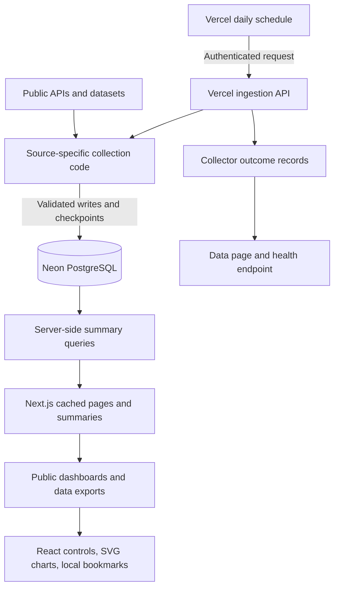

# gcdTracker: executive overview

Updated September 9, 2026 (Pacific time). GitHub is used only to host source files; GitHub Actions is disabled and no workflow definitions are included.

## What the site does

gcdTracker is an observatory of AI-related activity across public internet sources. Its strongest role is making scattered evidence understandable: crawler measurements, public coding-agent activity, automation on shared knowledge platforms, and growth of AI tooling. It collects existing public evidence, stores historical observations, and presents charts with source and coverage information.

The site does not run AI agents to crawl the whole web, and it does not have a global meter of every model request. Many signals are indirect. A bot account, branch name, edit tag, or package download can suggest activity without proving which model generated it. Ordinary automation is not automatically AI.

The homepage contains the Agents to destinations animation, a multi-year census, a daily GitHub heatmap, and recent public records. The animation illustrates stored observations; its moving dots are not a live stream of internet requests. The left menu navigates between these reports. Traffic is the main crawler-analysis page; the Research menu groups GitHub, Wikipedia, Maps, Forums, Tooling, historical comparisons, and Notes. Data explains collection status and exports; Methods explains evidence and limitations; Saved stores bookmarks in the reader's browser.

Requests to gcdTracker itself are no longer collected as an analytics source. Legacy visitor URLs redirect to Traffic. Old database tables remain so the redesign does not destroy prior history. The `/demo` page uses clearly identified synthetic fixtures; it is not evidence about production activity.

## The architecture in one picture

There is one application repository and one main database. The same Next.js application supplies the website and API routes. Vercel invokes routine collection once daily; there is no permanent background server, GitHub runner, or message queue in this architecture.

## Technology and responsibilities

| Layer | Technology in the repository | What it does |
|---|---|---|
| Application framework | Next.js 16.3.4, React 19.2.8, TypeScript | Server-rendered pages, API routes, interactive controls, compile-time checks |
| Hosting | Vercel | Builds GitHub code, hosts pages and serverless API functions, maintains preview and production deployments |
| Persistent storage | Neon managed PostgreSQL | Stores observations, daily/hourly aggregates, source metadata, collection progress and run outcomes |
| Database access | Drizzle ORM 0.45.x and Neon serverless driver 1.1.x | Typed schema, parameterized SQL and HTTP database access; explicit transactions for protected writes |
| Scheduled collection | Vercel Cron and Next.js API routes | Invokes the routine collector once daily within Vercel serverless limits |
| Presentation | Tailwind CSS 4, custom CSS, custom React/SVG charts, Fontsource fonts | Layout, navigation, typography, line graphs, calendar heatmaps and animation |
| Validation/content | Zod 4 and marked 18 | Structured input validation and Markdown rendering |
| Quality checks | ESLint 9, TypeScript, Vitest 5, Playwright, PostgreSQL 16 test service | Static analysis, logic tests, isolated database checks and browser tests |

The production application has no LLM SDK or model-inference service in its dependency list. AI APIs are not being called to generate answers for site visitors. The operating dependencies are Vercel hosting, Neon database storage/compute, and access to third-party data. No Redis, production Docker cluster, vector database, or separate analytics warehouse is required by the current code.

## What the data sources actually measure

| Source family | Data and interpretation |
|---|---|
| Cloudflare Radar | Cloudflare's observed bot traffic, normalized operator trends and crawl/referral metrics; a view of its network, not every internet request |
| Common Crawl robots samples | Explicit named-token full-block directives in sampled robots.txt files; stated policy, not observed compliance |
| GH Archive | Public GitHub event counts, detected agent PRs, hourly coverage and daily/monthly aggregates |
| GitHub APIs | Search matches, documented bot accounts, branch patterns, selected repositories and contribution signatures; some matches can overlap |
| Wikipedia, Wikidata, Commons | Platform filters, tagged/flagged edits, bot contributions and files added to tracked AI categories |
| OpenStreetMap | A capped sample of recently created changesets, with deduplication and recorded AI-related evidence |
| Moltbook | Platform-reported public posts and activity |
| Tooling/context sources | npm/PyPI downloads, MCP registry metadata, Hugging Face datasets/model metadata, ai.robots.txt catalog history and external baseline series |

Counts from different rows should not be summed. A download, PR, pageview and edit are different units. Likewise, a crawler's operator is easier to identify than the specific model behind a request.

## How a collection cycle works

1. Vercel invokes `/api/ingest/all` once daily with the configured authorization secret.
2. Each enabled routine collector requests its upstream source, validates the response, normalizes fields, and writes to PostgreSQL. Durable checkpoints allow bounded jobs to resume.
3. The API records `success`, `partial`, `failed`, or `disabled` for every attempted source. Browser refreshes read cached database summaries and do not force upstream collection.

GH Archive, Common Crawl robots census, and ai.robots.txt history no longer have scheduled workers. Their stored observations remain available with existing coverage metadata.

## GitHub repository automation

GitHub Actions is disabled. The repository contains no workflow definitions, Actions secrets, Actions variables, caches, or artifacts. Old workflow notification emails describe historical runs and can be ignored. Code validation is run locally, while Vercel continues to build deployments through its separate Git integration.

## Code map and data ownership

| Location | Responsibility |
|---|---|
| `src/app/` | Page routes, layouts and API handlers |
| `src/components/` | Reusable interface, navigation, charts, animation and bookmarks |
| `src/lib/ingest/` | Collectors, authentication, response validation, progress and transaction helpers |
| `src/lib/stats*.ts`, `home-reports.ts` | Database reads, aggregate definitions and presentation data |
| `src/lib/db/schema.ts` | PostgreSQL tables and indexes |
| `src/lib/public-*.ts` | Public field allowlists and safe metadata projection |
| `scripts/` | Local catalog maintenance and isolated QA utilities |
| `data/` | Versioned reference catalogs and source snapshots shipped with the code |
| `content/` | Research articles and supporting editorial content |
| `drizzle/`, `docs/` | Reviewed migrations, release/rollback guidance and operating documentation |
| `tests/` and colocated `*.test.ts` | Browser, integration and unit regression coverage |

PostgreSQL holds three main classes of records: source observations and historical aggregates; source catalogs; and operational records such as durable `collector_state`, short-lived `ingest_runs`, deduplication IDs and completed archive hours. A failed collection should not erase previous usable observations. Methodology versions separate repaired definitions from legacy history.

Application credentials belong in Vercel environment settings. Previews use an isolated `PREVIEW_DATABASE_URL`; without it, they are deliberately offline. Production credentials must not be copied into local QA fixtures or committed to GitHub.

## What to watch as the owner

The central product risk is interpretation: useful evidence must not imply complete internet coverage or certain AI authorship. The central operational risk is source drift: publishers change response formats, availability and limits. The database and app can be healthy while an external metric is stale.

Priorities are reliable collection and visible coverage, then comparable crawler-purpose and crawl-to-referral trends. Track database growth and Vercel usage before broadening collection. Keep migrations explicit and tested against an isolated database copy. Preserve a restore point before production schema changes; deploying code alone does not apply SQL migrations.

## References

- [Repository](https://github.com/eshin087/gcdtracker), [operating procedures](operations.md), [QA guide](qa.md), [audit](qa-audit.md).
- Cloudflare documents the [bot catalog](https://developers.cloudflare.com/api/resources/radar/subresources/bots/methods/list/) and [bot details including signatureAgentUrl](https://developers.cloudflare.com/api/resources/radar/subresources/bots/methods/get/).
- Cloudflare's [crawler summary API](https://developers.cloudflare.com/api/resources/radar/subresources/bots/subresources/web_crawlers/methods/summary/) and [normalization definitions](https://developers.cloudflare.com/radar/concepts/normalization/) explain why units and observation windows must remain attached to the values.
