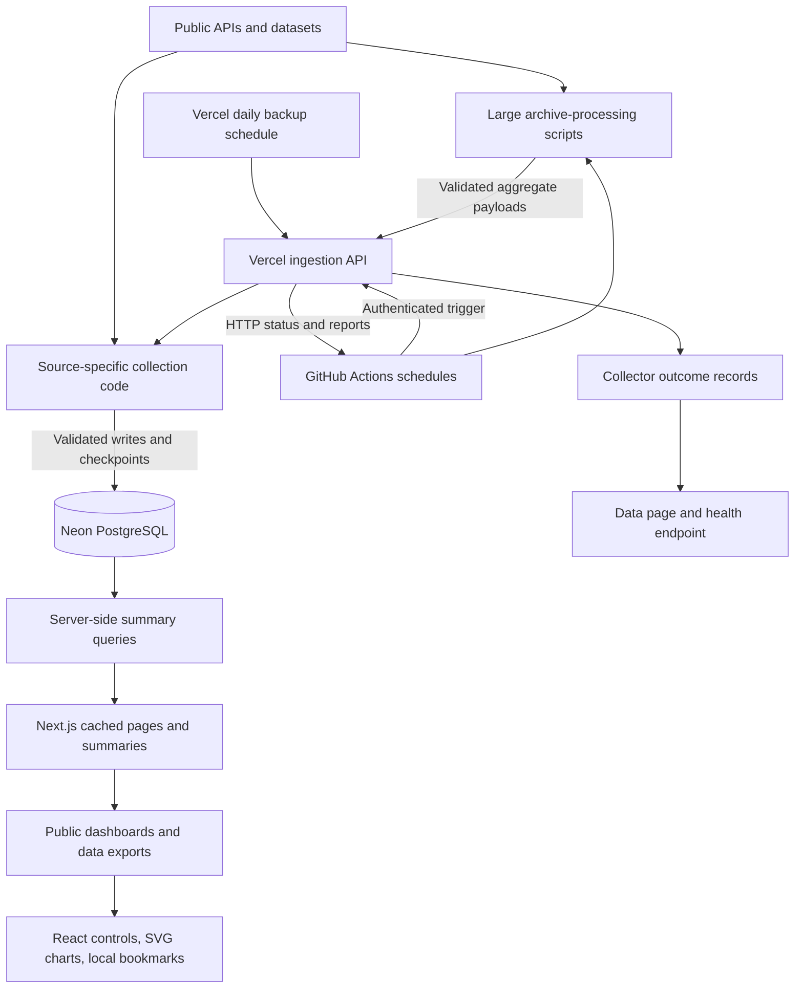

# gcdTracker: executive overview

Reviewed September 8, 2026 (Pacific time). This report describes the deployed `main` release (`aaef4d3`) and identifies changes prepared in the workflow repair branch. It is a code and operations review, not a claim of complete internet coverage.

## What the site does

gcdTracker is an observatory of AI-related activity across public internet sources. Its strongest role is making scattered evidence understandable: crawler measurements, public coding-agent activity, automation on shared knowledge platforms, and growth of AI tooling. It collects existing public evidence, stores historical observations, and presents charts with source and coverage information.

The site does not run AI agents to crawl the whole web, and it does not have a global meter of every model request. Many signals are indirect. A bot account, branch name, edit tag, or package download can suggest activity without proving which model generated it. Ordinary automation is not automatically AI.

The homepage contains the Agents to destinations animation, a multi-year census, a daily GitHub heatmap, and recent public records. The animation illustrates stored observations; its moving dots are not a live stream of internet requests. The left menu navigates between these reports. Traffic is the main crawler-analysis page; the Research menu groups GitHub, Wikipedia, Maps, Forums, Tooling, historical comparisons, and Notes. Data explains collection status and exports; Methods explains evidence and limitations; Saved stores bookmarks in the reader's browser.

Requests to gcdTracker itself are no longer collected as an analytics source. Legacy visitor URLs redirect to Traffic. Old database tables remain so the redesign does not destroy prior history. The `/demo` page uses clearly identified synthetic fixtures; it is not evidence about production activity.

## The architecture in one picture

There is one application repository and one main database. The same Next.js application supplies the website and API routes. Source collection runs only when a schedule or authorized request invokes it; there is no permanent background server or message queue in this architecture.

## Technology and responsibilities

| Layer | Technology in the repository | What it does |
|---|---|---|
| Application framework | Next.js 16.3.4, React 19.2.8, TypeScript | Server-rendered pages, API routes, interactive controls, compile-time checks |
| Hosting | Vercel | Builds GitHub code, hosts pages and serverless API functions, maintains preview and production deployments |
| Persistent storage | Neon managed PostgreSQL | Stores observations, daily/hourly aggregates, source metadata, collection progress and run outcomes |
| Database access | Drizzle ORM 0.45.x and Neon serverless driver 1.1.x | Typed schema, parameterized SQL and HTTP database access; explicit transactions for protected writes |
| Scheduled compute | GitHub Actions with Node.js scripts | Invokes routine collection and processes archive files too large for short serverless requests |
| Presentation | Tailwind CSS 4, custom CSS, custom React/SVG charts, Fontsource fonts | Layout, navigation, typography, line graphs, calendar heatmaps and animation |
| Validation/content | Zod 4 and marked 18 | Structured input validation and Markdown rendering |
| Quality checks | ESLint 9, TypeScript, Vitest 5, Playwright, PostgreSQL 16 test service | Static analysis, logic tests, isolated database checks and browser tests |

The production application has no LLM SDK or model-inference service in its dependency list. AI APIs are not being called to generate answers for site visitors. The operating dependencies are hosting, database storage/compute, workflow minutes, and access to third-party data. No Redis, production Docker cluster, vector database, or separate analytics warehouse is required by the current code.

## What the data sources actually measure

| Source family | Data and interpretation |
|---|---|
| Cloudflare Radar | Cloudflare's observed bot traffic, normalized operator trends and crawl/referral metrics; a view of its network, not every internet request |
| Common Crawl robots samples | Explicit named-token full-block directives in sampled robots.txt files; stated policy, not observed compliance |
| GH Archive | Public GitHub event counts, detected agent PRs, hourly coverage and daily/monthly aggregates |
| GitHub APIs | Search matches, documented bot accounts, branch patterns, selected repositories and contribution signatures; some matches can overlap |
| Wikipedia, Wikidata, Commons | Platform filters, tagged/flagged edits, bot contributions and files added to tracked AI categories |
| OpenStreetMap | A capped sample of recently created changesets, with deduplication and recorded AI-related evidence |
| Moltbook | Platform-reported public posts and activity |
| Tooling/context sources | npm/PyPI downloads, MCP registry metadata, Hugging Face datasets/model metadata, ai.robots.txt catalog history and external baseline series |

Counts from different rows should not be summed. A download, PR, pageview and edit are different units. Likewise, a crawler's operator is easier to identify than the specific model behind a request.

## How a collection cycle works

1. GitHub starts a workflow on its configured schedule, or an operator starts it manually.
2. The routine workflow sends an authenticated request to `/api/ingest/all`. `CRON_SECRET` protects this write endpoint. Heavy workers instead fetch/process archives in GitHub and post bounded aggregate payloads.
3. Each collector requests its upstream source, validates the response, normalizes fields and writes to PostgreSQL. Durable checkpoints allow lengthy jobs to resume. Different sources have independent progress.
4. The API records a result for each source: `success`, `partial`, `failed`, or `disabled`. Partial means the collected portion is useful but incomplete; it is not equivalent to a complete successful refresh. Failed means an error occurred. Disabled means the source is intentionally unavailable under its configuration.
5. Summary queries turn stored observations into the public charts. Shared summaries generally cache for five minutes. `/api/live` has a shorter 30-second cadence. Browser refreshes do not force upstream collection.

The API's combined job has a 240-second execution limit and divides its remaining time among sources. Long archive/history work belongs in GitHub workers. A single source failure makes the combined HTTP response fail, while already committed data from successful sources remains available.

## What the workflow emails mean

A workflow is a small automated program described by a YAML file under `.github/workflows/`. A run is one execution of that program. GitHub sends the notification because its job exits unsuccessfully; that does not necessarily mean the website is down or every collector failed.

| Workflow | Configured schedule, UTC | Purpose |
|---|---|---|
| `ingest` | Every 30 minutes | Routine API sources, source catalogs, baselines and retention |
| `gharchive` | At minute 17 every third hour | Processes recent public GitHub event archives, replaces hours atomically, rebuilds daily totals |
| `robots-census` | Mondays at 06:43 | Samples one missing Common Crawl robots dataset per invocation |
| `ai-robots-history` | First day of each month at 05:23 | Walks the ai.robots.txt repository history to date known crawler tokens |
| `QA` | Pull requests, pushes to main, or manual starts | Dependency audit, lint, types, unit tests, isolated database checks, production builds and browser QA |

Vercel also has a daily 03:00 UTC ingestion trigger. These are configured schedules, not guarantees of an exact start time. Recent routine runs in the inspected history were hours apart, despite the half-hour definition. Historical backfills and external-source delays affect when data becomes visible.

QA and collection are different: a green QA run proves the tested code behavior, while a green collector run confirms that a particular external-source refresh completed. Vercel deployment builds form a third operational track. It is possible for the website deployment to succeed while an upstream collection fails.

## The current email incident and prepared repair

The latest inspected email concerns [ingest run 34298100827](https://github.com/eshin087/gcdtracker/actions/runs/34298100827), finished September 9 at 01:13 UTC (September 8 at 18:13 Pacific). The job received HTTP 500. The source report shows two failures:

- `agentwatch`: the signature-registry text download returned HTTP 403. The scheduler also fetched zero registry lines. Retrying the same blocked download did not refresh the catalog.
- `radar`: the crawl/referral parser rejected a summary value. Its old conversion required every value to be finite; one unavailable/non-finite value rejected the complete group. The logs do not include the rejected raw value, so its exact current encoding still requires authenticated verification.

Other sources succeeded or returned useful partial progress. No evidence in that run indicates database deletion or a total site outage. An earlier run also encountered a transient Hugging Face 502.

The repair branch replaces the challenged text-file request with the documented authenticated Radar bot catalog/details API, processes at most 20 details per invocation, and saves progress atomically. It preserves existing catalog observations and does not interpret catalog membership as verified incoming traffic. Completed scans wait one day before starting another scan.

Radar parsing now supports finite ratios and explicit unavailable/non-finite ratio states, preserving the latter in metadata instead of inserting zeros. Public output includes that missingness even if a snapshot has no finite values. Invalid structures still fail. GET requests receive one bounded retry for 502/503/504, while write requests and authorization failures are not retried. Workflow logs now include a per-source summary and named failure annotations.

No database migration or historical backfill is part of this repair. Changes must be deployed before production collector behavior changes. PR #3, the separate homepage count/heatmap fix, was still open when this report was prepared; this workflow repair does not merge it implicitly.

## Code map and data ownership

| Location | Responsibility |
|---|---|
| `src/app/` | Page routes, layouts and API handlers |
| `src/components/` | Reusable interface, navigation, charts, animation and bookmarks |
| `src/lib/ingest/` | Collectors, authentication, response validation, progress and transaction helpers |
| `src/lib/stats*.ts`, `home-reports.ts` | Database reads, aggregate definitions and presentation data |
| `src/lib/db/schema.ts` | PostgreSQL tables and indexes |
| `src/lib/public-*.ts` | Public field allowlists and safe metadata projection |
| `scripts/` | Archive workers, workflow runner, repair and isolated QA utilities |
| `data/` | Versioned reference catalogs and source snapshots shipped with the code |
| `content/` | Research articles and supporting editorial content |
| `drizzle/`, `docs/` | Reviewed migrations, release/rollback guidance and operating documentation |
| `tests/` and colocated `*.test.ts` | Browser, integration and unit regression coverage |

PostgreSQL holds three main classes of records: source observations and historical aggregates; source catalogs; and operational records such as durable `collector_state`, short-lived `ingest_runs`, deduplication IDs and completed archive hours. A failed collection should not erase previous usable observations. Methodology versions separate repaired definitions from legacy history.

Application credentials belong in Vercel environment settings. GitHub workflows use a repository secret for ingestion authorization and a repository variable for the target URL. Previews use an isolated `PREVIEW_DATABASE_URL`; without it, they are deliberately offline. Production credentials must not be copied into CI fixtures or committed to GitHub.

## What to watch as the owner

The central product risk is interpretation: useful evidence must not imply complete internet coverage or certain AI authorship. The central operational risk is source drift: publishers change response formats, availability and limits. The database and app can be healthy while an external metric is stale.

Priorities are reliable collection and visible coverage, then comparable crawler-purpose and crawl-to-referral trends. Track database growth, workflow minutes and Vercel usage before broadening backfills. Keep migrations explicit and tested against an isolated database copy. Preserve a restore point before production schema changes; deploying code alone does not apply SQL migrations.

## References

- [Repository](https://github.com/eshin087/gcdtracker), [operating procedures](operations.md), [QA guide](qa.md), [audit](qa-audit.md).
- Cloudflare documents the [bot catalog](https://developers.cloudflare.com/api/resources/radar/subresources/bots/methods/list/) and [bot details including signatureAgentUrl](https://developers.cloudflare.com/api/resources/radar/subresources/bots/methods/get/).
- Cloudflare's [crawler summary API](https://developers.cloudflare.com/api/resources/radar/subresources/bots/subresources/web_crawlers/methods/summary/) and [normalization definitions](https://developers.cloudflare.com/radar/concepts/normalization/) explain why units and observation windows must remain attached to the values.
